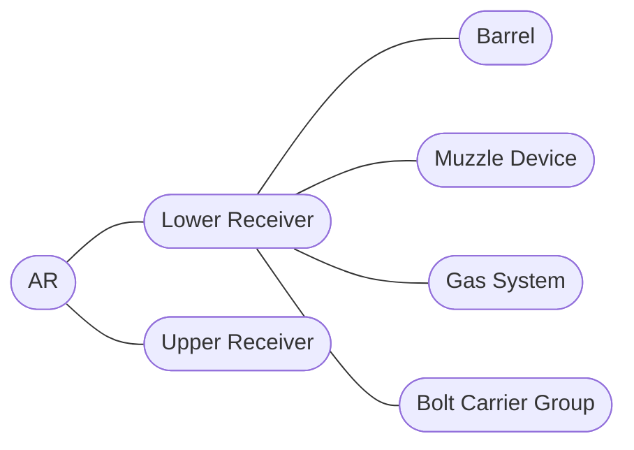

# BuildingGun

```mermaid

graph LR;
  ar([AR]);
  lo([Lower Receiver]);
  up([Upper Receiver]);
  barr([Barrel]);
  muzz([Muzzle Device]);
  gas([Gas System]);
  bolt([Bolt Carrier Group]);
  ar --- lo;
  ar --- up;
  lo --- barr;
  lo --- muzz;
  lo --- gas;
  lo --- bolt;
```
