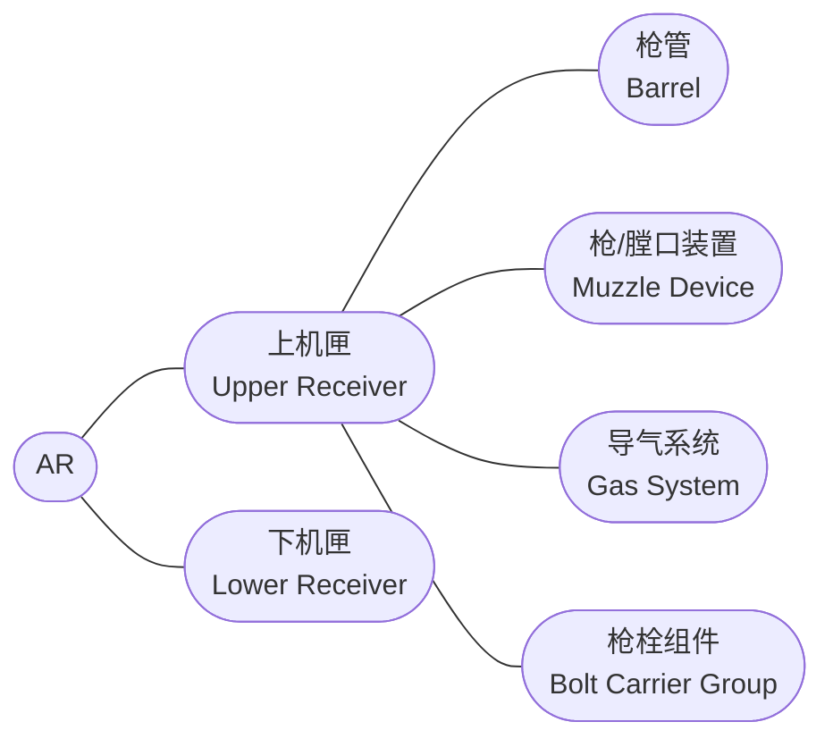

# BuildingGun

```mermaid

graph LR;
  ar([AR]);
  up([上机匣
  Upper Receiver]);
  lo([下机匣
  Lower Receiver]);
  barr([枪管
  Barrel]);
  muzz([枪/膛口装置
  Muzzle Device]);
  gas([导气系统
  Gas System]);
  bolt([枪栓组件
  Bolt Carrier Group]);
  ar --- lo;
  ar --- up;
  up --- barr;
  up --- muzz;
  up --- gas;
  up --- bolt;
```
