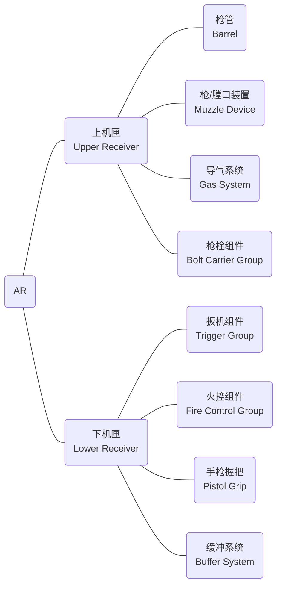

# BuildingGun

```mermaid

graph LR;
  ar(AR);
  up(上机匣
  Upper Receiver);
  lo(下机匣
  Lower Receiver);
  barr(枪管
  Barrel);
  muzz(枪/膛口装置
  Muzzle Device);
  gas(导气系统
  Gas System);
  bolt(枪栓组件
  Bolt Carrier Group);
  trig(扳机组件
  Trigger Group);
  fire(火控组件
  Fire Control Group);
  pist(手枪握把
  Pistol Grip);
  buff(缓冲系统
  Buffer System);
  ar --- up;
  ar --- lo;
  up --- barr;
  up --- muzz;
  up --- gas;
  up --- bolt;
  lo --- trig;
  lo --- fire;
  lo --- pist;
  lo --- buff;
```
